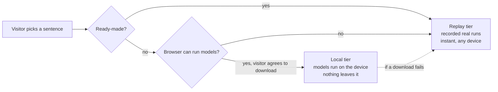

# k_ai-playground

> 🌐 **Not a coder? Follow one sentence through an AI, on your phone — nothing to install:**
> https://khadir-syed.github.io/k_ai-playground/

> Type a sentence and watch an AI chop it up, find its meaning and guess a reply — step by step, right in your web browser. No sign-ups, no server of ours, no credit card.

[](https://khadir-syed.github.io/)
[](LICENSE)

Most people only see what comes *out* of an AI. Here you get a tour inside, like a factory with
glass walls, and you watch every machine work on *your* words.

Part of the k_ai series:
[k_ai-basics](https://github.com/khadir-syed/k_ai-basics) (how AI works, in code) ·
[k_ai-agent-skills](https://github.com/khadir-syed/k_ai-agent-skills) (putting AI to work) ·
**k_ai-playground** (seeing AI work, in the browser).

## The story: follow one sentence through AI

| # | Chapter | What you'll see |
|---|---|---|
| 1 | [AI doesn't read words](chapters/01-tokens/) | Your sentence chopped into small numbered pieces |
| 2 | [Meaning is a place](chapters/02-galaxy/) | Your sentence as a star in a galaxy, next to sentences that mean similar things |
| 3 | [AI is a guessing machine](chapters/03-theater/) | A reply written one guess at a time. You can even pick the next word yourself |

When you finish, you get a picture of **your sentence's journey** to share or save. It's made on
your phone, and nothing is sent anywhere.

## Bonus rounds

| | Chapter | What you'll see |
|---|---|---|
| B1 | [You can teach an AI](chapters/04-teach/) | Sort examples into two groups, and the AI learns to guess new ones. Make up your own groups too |
| B2 | [Pull the plug](chapters/05-plug/) | Turn on airplane mode, and the AI on your phone keeps working |

## The museum

Finish the story and the **museum** opens: every chapter, in any order. On the first page you'll
see it locked. Coming back later? Use this link to go straight in:
<https://khadir-syed.github.io/k_ai-playground/#museum> (the site doesn't remember you, on purpose).

## Is it safe?

- **No sign-up and no key.** Ready-made sentences start straight away. They show real AI results
  we saved earlier.
- **Your words stay on your device.** If you type your own sentence, the site asks before it
  downloads a small AI to your device (about 40–50 MB, plus about 115–130 MB to make chapter 3
  live). Nothing you type is ever sent anywhere.
- **No cookies.** We only count visits and which chapters people finish, never what anyone types.

---

# For developers

## How the three tiers work



A third tier, **bring your own key** (Claude or OpenAI), is planned for the Jarvis chapters. No
chapter uses it yet.

## Run it on your computer

You need Python 3 (to serve the files) and Node.js 20+ (only for the self-checks).

1. Open a terminal and go into this folder.
2. Start a tiny local web server:

   ```bash
   python3 -m http.server 8000
   ```

3. Open <http://localhost:8000> in your browser. To see the phone layout, open your browser's
   developer tools and switch on device mode.
4. Run the self-checks (they need no internet and no model download):

   ```bash
   node --test "tests/*.test.mjs"
   ```

## What's inside

| Folder | What it holds |
|---|---|
| [`engine/`](engine/) | Shared code: runtime tiers, model calls, math. Jarvis will reuse it. |
| [`chapters/`](chapters/) | One folder per story chapter: UI only, logic stays in `engine/` |
| [`replays/`](replays/) | Recorded real model runs (Replay tier + test data) |
| [`vendor/`](vendor/) | Pinned, hash-checked third-party JavaScript |
| [`tools/`](tools/) | Offline scripts, such as re-recording replays. Never shipped to the site. |
| [`tests/`](tests/) | Self-checks, including security rules |
| [`docs/DESIGN.md`](docs/DESIGN.md) | Why it's built this way |
| `og-image.png` | The picture shown when the link is shared ([source](tools/og-image.html)) |

## Contributing

Read [CONTRIBUTING.md](CONTRIBUTING.md) and [SECURITY_CHECKLIST.md](SECURITY_CHECKLIST.md) first.
By taking part you agree to the [Code of Conduct](CODE_OF_CONDUCT.md).

## License

[MIT](LICENSE)
