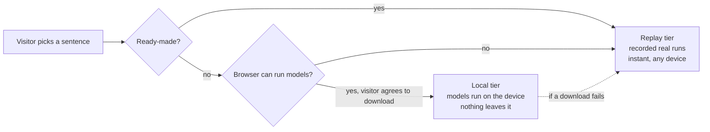

# k_ai-playground

**▶ Try it: <https://khadir-syed.github.io/k_ai-playground/>**

**See AI from the inside.** Type a sentence, then follow it through an AI: watch it get chopped
into tokens, land as a star in a galaxy of meaning, and get answered one guess at a time — all in
your browser, on your phone, with no account and no API key.

Think of it like a glass-walled factory tour. Most people only ever see what comes out of an AI.
This playground lets you walk the factory floor and watch every machine work on *your* words.

Part of the k_ai series:
[k_ai-basics](https://github.com/khadir-syed/k_ai-basics) (how AI works, in code) ·
[k_ai-agent-skills](https://github.com/khadir-syed/k_ai-agent-skills) (putting AI to work) ·
**k_ai-playground** (seeing AI work, in the browser).

## The story: "Follow one sentence through AI"

| # | Chapter | What you see | Tiers |
|---|---|---|---|
| 1 | [AI doesn't read words](chapters/01-tokens/) | Your sentence chopped into numbered tokens | Replay · Local |
| 2 | [Meaning is a place](chapters/02-galaxy/) | Your sentence as a star in a 3D galaxy of meaning, next to its nearest neighbours | Replay · Local |
| 3 | [AI is a guessing machine](chapters/03-theater/) | A reply built token by token, with live odds and a temperature slider — tap a bar to choose the next word yourself | Replay · Local |

**Bonus round** (after the story):

| | Chapter | What you see | Tiers |
|---|---|---|---|
| B1 | [You can teach an AI](chapters/04-teach/) | Sort examples into two groups, then watch it guess new ones. Name your own groups on your device | Replay · Local |
| B2 | [Pull the plug](chapters/05-plug/) | Turn on airplane mode, and the AI on your device keeps answering | Local |

At the end of the story, you get a picture of **your sentence's journey** to share or save. It's made on your
device and nothing is uploaded.

**No chapter needs an API key.** Ready-made sentences use recorded runs of real models and work
instantly on any device. Typing your own sentence downloads small AI models into your browser
(about 40–50 MB, plus about 115–130 MB for live chapter 3), after you agree to it. Nothing you
type leaves your device.

## How the three tiers work



A third tier, **bring your own key** (Claude or OpenAI), is planned for the Jarvis chapters. No
chapter uses it yet.

## Run it on your computer

You need Python 3 (to serve the files) and Node.js 20+ (only for the self-checks).

1. Open a terminal and go into this folder.
2. Start a tiny local web server:

   ```bash
   python3 -m http.server 8000
   ```

3. Open <http://localhost:8000> in your browser. To see the phone layout, open your browser's
   developer tools and switch on device mode.
4. Run the self-checks (they need no internet and no model download):

   ```bash
   node --test "tests/*.test.mjs"
   ```

## What's inside

| Folder | What it holds |
|---|---|
| [`engine/`](engine/) | Shared code: runtime tiers, model calls, math. Jarvis will reuse it. |
| [`chapters/`](chapters/) | One folder per story chapter: UI only, logic stays in `engine/` |
| [`replays/`](replays/) | Recorded real model runs (Replay tier + test data) |
| [`vendor/`](vendor/) | Pinned, hash-checked third-party JavaScript |
| [`tools/`](tools/) | Offline scripts, such as re-recording replays. Never shipped to the site. |
| [`tests/`](tests/) | Self-checks, including security rules |
| [`docs/DESIGN.md`](docs/DESIGN.md) | Why it's built this way |
| `og-image.png` | The picture shown when the link is shared ([source](tools/og-image.html)) |

## Contributing

Read [CONTRIBUTING.md](CONTRIBUTING.md) and [SECURITY_CHECKLIST.md](SECURITY_CHECKLIST.md) first.
By taking part you agree to the [Code of Conduct](CODE_OF_CONDUCT.md).

## License

[MIT](LICENSE)
