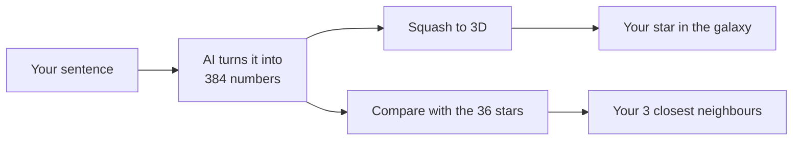

# Chapter 2: Meaning is a place

**In one line:** the AI turns your sentence into a list of numbers, and those numbers work like an
address in a galaxy of meaning.

## Picture this

Every sentence gets a home in a giant galaxy. Sentences about the weather live on one street.
Sentences about food live on another. Finding sentences that mean the same thing is just
finding your neighbours.

## Try it

1. Your sentence appears as a bright white star among 36 others, in six colours (weather,
   animals, food, tech, feelings, sports).
2. Drag to spin the galaxy. Tap a star to read it.
3. See your sentence's three closest neighbours, and how similar each one is.

## What you'll find out

- An AI can turn *meaning* into numbers (384 of them here).
- Sentences that mean similar things get similar numbers, so they sit close together.
- This is how AI search finds things by meaning, even when the words are different.
- The 3D picture is a squashed view, like a toy's shadow on a wall. The neighbour list uses all
  384 numbers, so it's more exact than the picture.

## How it works

---

### For developers

- The numbers are an *embedding*; the squash is PCA (power iteration); "how similar" is cosine
  similarity. This is the same idea search-by-meaning (RAG) uses.
- **Tiers:** Replay (ready-made sentences) · Local (your own sentence, using the 23 MB
  all-MiniLM-L6-v2 model). No API key.
- **Engine used:** `embed()` in [`engine/ai.js`](../../engine/ai.js); `pca()`, `project()` and
  `cosine()` in [`engine/math.js`](../../engine/math.js).
