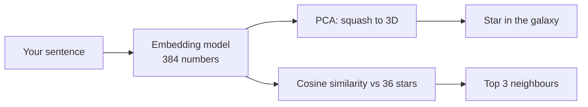

# Chapter 2 — Meaning is a place

**Analogy:** every sentence gets a home address in a giant galaxy. Sentences about the weather
live on one street, sentences about food on another. Finding "things that mean the same" is just
finding your neighbours.

**What you do:** watch your sentence appear as a bright star among 36 others in six colour-coded
families. Drag to spin, tap a star to read it, and see its three nearest neighbours with a
similarity score.

**What you learn:**
- An AI turns meaning into a list of numbers (an *embedding*: 384 of them here).
- Similar meaning means nearby numbers. That's how "search by meaning" (RAG) finds the right document.
- The 3D picture is a squashed view (PCA). The neighbour list uses all 384 numbers.

**Tiers:** Replay (ready-made sentences) · Local (your own sentence, using the 23 MB
all-MiniLM-L6-v2 model). No API key.

**Engine used:** `embed()` in [`engine/ai.js`](../../engine/ai.js); `pca()`, `project()` and
`cosine()` in [`engine/math.js`](../../engine/math.js).
