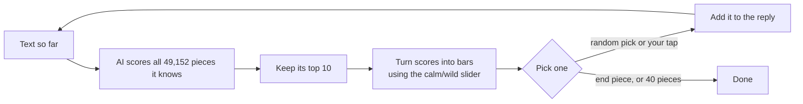

# Chapter 3: AI is a guessing machine

**In one line:** an AI doesn't *know* the answer. It guesses the next piece, adds it, and guesses
again, over and over.

## Picture this

Think of the word suggestions above your phone keyboard. Now imagine tapping the top suggestion
again and again. That's how an AI writes a reply.

## Try it

1. Press **Next token** (one piece at a time) or **▶ Play**.
2. The bars show the AI's favourite guesses for the next piece. Taller bar = it likes it more.
3. Move the slider from 🧊 **calm** to 🔥 **wild**. Calm plays it safe. Wild takes surprising
   picks. (Grown-ups call this slider *temperature*.)
4. In live mode, **tap any bar to choose the next piece yourself**, and watch the AI carry on
   from your choice.

## What you'll find out

- Writing a reply is just guessing the next piece, again and again.
- Calm answers are safe but can be boring. Wild answers are surprising but can get silly.
- A small AI can get stuck in a loop ("I don't know. I don't know.") if it always picks the
  tallest bar. A little wildness helps it escape.

## How it works

---

### For developers

- The bars are softmax over the top 10 logits with temperature. Replay runs were recorded greedily
  (always the top token), so in Replay the slider reshapes the bars only.
- **Tiers:** Replay (ready-made sentences) · Local (SmolLM2-135M-Instruct in the browser: 112 MB
  with WebGPU, or 130 MB without, which is slower). Live mode samples and lets you pick tokens.
- No API key. Claude's API doesn't return token odds, so this chapter will never use
  bring-your-own-key with Claude.
- **Engine used:** `chatPromptIds()` and `nextTokenOdds()` in [`engine/ai.js`](../../engine/ai.js);
  `softmax()` and `sample()` in [`engine/math.js`](../../engine/math.js).
- **Python twin:** [`python/03_theater.py`](../../python/03_theater.py) does the same thing on your computer.
