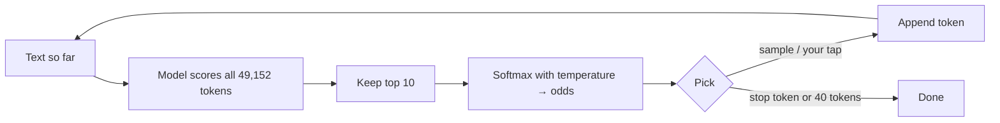

# Chapter 3 — AI is a guessing machine

**Analogy:** think of a phone keyboard's word suggestions, played on repeat. The AI looks at
everything so far, scores every possible next piece, picks one, adds it, and does it all again.
It doesn't *know* the answer. It predicts it, one token at a time.

**What you do:** press **Next token** or **▶ Play** and watch a reply get built. The bars show
the AI's top guesses for the next token. Slide **temperature** from 🧊 calm to 🔥 wild. In live
mode, **tap any bar to choose the next token yourself** and watch the AI carry on from your choice.

**What you learn:**
- Text generation is repeated next-token prediction.
- Temperature trades safe and boring against surprising and odd.
- Small models can get stuck in loops ("I don't know. I don't know.") when they always take the
  top guess, and a little randomness helps them escape.

**Tiers:**
- **Replay:** ready-made sentences, recorded greedy runs. Temperature reshapes the bars only.
- **Local:** SmolLM2-135M-Instruct in the browser. That's 112 MB with WebGPU, or 130 MB without
  (slower). It samples live, and you can pick tokens yourself.
- No API key. Claude's API doesn't return token odds, so this chapter will never use bring-your-own-key with Claude.

**Engine used:** `chatPromptIds()` and `nextTokenOdds()` in [`engine/ai.js`](../../engine/ai.js);
`softmax()` and `sample()` in [`engine/math.js`](../../engine/math.js).
