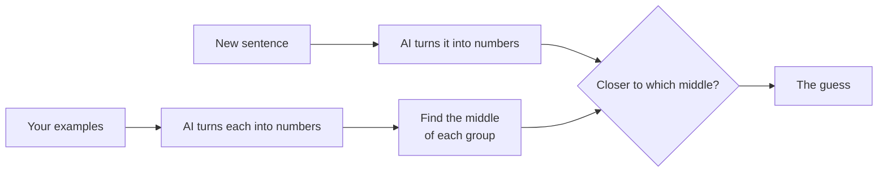

# Bonus 1: You can teach an AI

**In one line:** an AI learns from examples. Give it good examples and it guesses well. Give it
bad ones and it learns the wrong thing.

## Picture this

Teaching a little kid to sort laundry: show them a few socks and a few shirts, and they work out
the pattern. Show them wrong examples, and they learn the wrong pattern.

## Try it

1. Sort 8 cards: tap 🍕 for food or 💻 for tech.
2. Tap a card the AI has never seen. It guesses food or tech, and you see if it was right.
3. One card is tricky on purpose: **"This website uses cookies"**. Cookies are a snack, but also
   a website thing. With honest sorting, the AI gets the other five right and this one wrong.
4. Put a card in the wrong group on purpose, then test again. What happens?
5. On your own device: make **your own two groups** (like Cats and Cars), write a few examples
   for each, and test it with any sentence.

## What you'll find out

- "Learning" here means: turn each example into meaning-numbers (like chapter 2), find the
  middle of each group, and put a new sentence with the closer middle.
- The AI only knows what its examples taught it.
- It tells you if it's sure: **a clear call**, **a close call**, or **a wild guess** (when the
  sentence isn't close to either group). It never shows a "% sure", because the numbers behind
  it don't mean that.

## How it works

---

### For developers

- Nearest centroid with cosine similarity. Raw similarities are small (about 0.05–0.4) even when
  right, so the UI shows only "closer", plus `CLOSE_CALL` and `FAR` verdicts from
  `engine/math.js`. Bars use a fixed scale, so a wild guess looks short.
- **Tiers:** Replay (the food/tech cards, embeddings recorded in `replays/story.json`) · Local
  (your own groups, using the 23 MB all-MiniLM-L6-v2 model). No API key. A bonus chapter, so it
  doesn't change `story-done`.
- **Engine used:** `embed()` in [`engine/ai.js`](../../engine/ai.js); `mean()` and
  `nearestGroup()` in [`engine/math.js`](../../engine/math.js).
- **Python twin:** [`python/04_teach.py`](../../python/04_teach.py) does the same thing on your computer.
