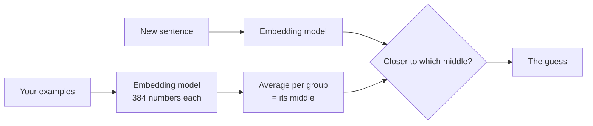

# Bonus 1 — You can teach an AI

**Analogy:** teaching a child to sort laundry. Show them a few socks and a few shirts, and they
work out the pattern. Show them wrong examples, and they learn the wrong pattern.

**What you do:**
1. Sort 8 cards into 🍕 Food or 💻 Tech.
2. Tap a card the AI has never seen, and it guesses the group. Two are tricky on purpose:
   "Robots can sort packages" (none of the examples were about robots) and "This website uses
   cookies" (a snack word used for a website thing).
3. On your device only: name **your own two groups**, write a few examples for each, and test
   it with any sentence.

**What you learn:**
- "Learning" here means: turn every example into meaning-numbers (chapter 2), average each group
  to find its middle, and put a new sentence with the closer middle.
- It only knows what its examples taught it. Bad or missing examples give bad guesses.

**Honest display:** the raw similarity numbers are small (about 0.05–0.4) even for right answers,
so the screen never shows them as "% sure". It says which group is closer, and whether that was a
clear call, a close call, or a wild guess (far from both groups). Bars use a fixed scale, so a
wild guess looks short.

**Tiers:** Replay (the food/tech cards, embeddings recorded in `replays/story.json`) · Local (your
own groups, using the 23 MB all-MiniLM-L6-v2 model). No API key. Not part of the 3-chapter story,
so it doesn't change `story-done`.

**Engine used:** `embed()` in [`engine/ai.js`](../../engine/ai.js); `mean()` and `nearestGroup()`
in [`engine/math.js`](../../engine/math.js).
