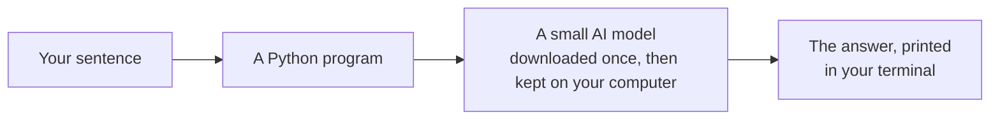

# The playground, in Python

> 🌐 **Not a coder? Play with it in your browser, on your phone — nothing to install:**
> https://khadir-syed.github.io/k_ai-playground/

## What is this?

Every page of the playground is also a short Python program. The programs live in this folder.

Same models, same sentences, same lessons. The difference is that you can see every line, change it,
and run it on your own computer.

| Program | Page on the site | What it shows |
|---|---|---|
| [`01_tokens.py`](01_tokens.py) | Chapter 1 | Your sentence, chopped into numbered pieces (tokens) |
| [`02_galaxy.py`](02_galaxy.py) | Chapter 2 | Your sentence as 384 numbers, and its closest neighbours by meaning |
| [`03_theater.py`](03_theater.py) | Chapter 3 | The AI guessing a reply one token at a time |
| [`04_teach.py`](04_teach.py) | Bonus 1 | Teach the AI two groups from a few examples |
| [`05_plug.py`](05_plug.py) | Bonus 2 | The AI still works with your Wi-Fi off |
| [`same_numbers.py`](same_numbers.py) | All of them | Proves your computer gets the exact numbers your phone got |

## How it works, in a picture



## What you need

- Python 3.12 or newer. To check, type `python3 --version` in your terminal (see step 1).
- About 1 GB of free space for the tools, plus about 500 MB for the models.
- No account, no password, no API key.

## How to run it, step by step

**1. Open your terminal**, and go into this folder. The terminal is a window where you type commands.
On a Mac, it's the app called **Terminal**. On Windows, it's **PowerShell**.

```bash
cd python
```

On Windows, type `py` wherever this page says `python3`.

**2. Make a clean little box for the tools**, so they don't mix with anything else on your computer:

```bash
python3 -m venv .venv
```

**3. Step into the box.** You'll see `(.venv)` at the start of the line:

```bash
source .venv/bin/activate
```

On Windows, type `.venv\Scripts\activate` instead.

**4. Give it its tools.** This is the big download (about 1 GB), so use Wi-Fi:

```bash
pip install -r requirements.txt
```

**5. Run chapter 1**, with any sentence you like in the quotes:

```bash
python 01_tokens.py "Will it rain tomorrow?"
```

The first time, each program downloads its model. After that, it's fast and works offline.

> 📅 **Example output, as of 3 October 2026.** A real run, copied here so you know what to expect.

```
“Will it rain tomorrow?”

  #  TOKEN              NUMBER
------------------------------
  0  Will                20314
  1  ␣it                   357
  2  ␣rain                5249
  3  ␣tomorrow           13759
  4  ?                      47

5 tokens · 22 letters
```

The `␣` is a space. The AI sticks it onto the front of the next word. The AI only ever sees the numbers.

**6. Try the others.**

```bash
python 02_galaxy.py "Will it rain tomorrow?"
```

```bash
python 03_theater.py "Will it rain tomorrow?"
```

```bash
python 03_theater.py --wild "Will it rain tomorrow?"
```

```bash
python 04_teach.py
```

```bash
python 04_teach.py --own
```

```bash
python 05_plug.py
```

```bash
python same_numbers.py
```

`--wild` lets the AI take surprising picks. `--own` lets you name your own two groups and type the examples.

**7. Close the box when you're done:**

```bash
deactivate
```

## Something surprising

Run chapter 3 with "Will it rain tomorrow?". Here, the AI writes a sensible reply. On the site, the same AI
gets stuck saying "I don't know. I don't know." Why?

The site uses a **smaller copy** of the model, with every number squeezed into a tiny space, so your phone
can download it. That squeezing changes some guesses a little, and here it was enough to make the AI loop.
`same_numbers.py` runs that smaller copy, and gets the site's answers exactly.

Notice something else: the reply starts "I'm sorry for the confusion", but nobody was confused! The AI
copies how chat replies usually begin. It's guessing what a reply *looks like*, not thinking about you.

---

# For developers

**Two stacks, on purpose.**

- The chapter programs use Hugging Face `transformers` with PyTorch, which is the stack you'd use at work.
  They load full-precision weights: `HuggingFaceTB/SmolLM2-135M-Instruct` and
  `sentence-transformers/all-MiniLM-L6-v2`. The site's `Xenova/all-MiniLM-L6-v2` is an ONNX-only
  conversion of the second one.
- `same_numbers.py` uses `onnxruntime` with the site's exact files (`onnx/model_quantized.onnx`, q8)
  at the same pinned commits. It replays everything in `../replays/story.json`. On this Mac, all
  160 chat-model steps matched, and the meaning numbers matched to within 0.0001.
- q8 is dynamic quantization, and activation scales are computed over the whole batch. So the same
  sentence gets slightly different numbers in a different batch. `same_numbers.py` uses the same
  batches as `tools/record-replays.mjs` for that reason.

**Layout.**

- [`kai.py`](kai.py) has the pinned models, the loaders, and the maths. The maths is a plain-Python
  copy of [`engine/math.js`](../engine/math.js): `softmax`, `top_k`, `cosine`, `mean` and
  `nearest_group`, with the same `CLOSE_CALL` and `FAR` thresholds.
- Heavy imports happen inside the loaders, so `kai.py` imports with no packages installed.
- Every model loads at a pinned `revision`, never `main`. `05_plug.py` sets `HF_HUB_OFFLINE=1`.

**Self-check.** `python test_kai.py` uses the standard library only and runs in CI on every push. It
checks:

- The maths.
- That `SITE_MODELS` matches `engine/ai.js`.
- That the limits match the site: 40 reply tokens, 120 letters, the Teach form's limits, and the
  close-call and far-away thresholds.
- That the Teach cards still give 5 right and 1 wrong.
- That every chapter's `python:` link points to a file here.

It doesn't download models. Run `same_numbers.py` by hand after re-recording the replays or changing
a model.

**Dependencies.** Exact versions are pinned in `requirements.txt`. Run `pip-audit -r requirements.txt`
before pushing (SECURITY_CHECKLIST.md). This folder is not published to the site.
